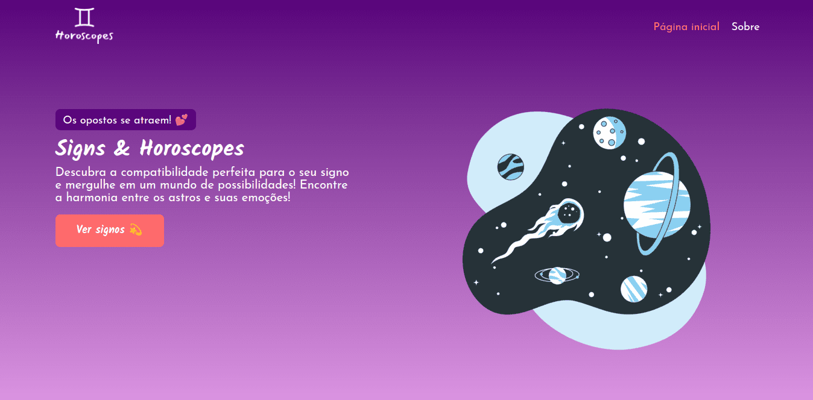
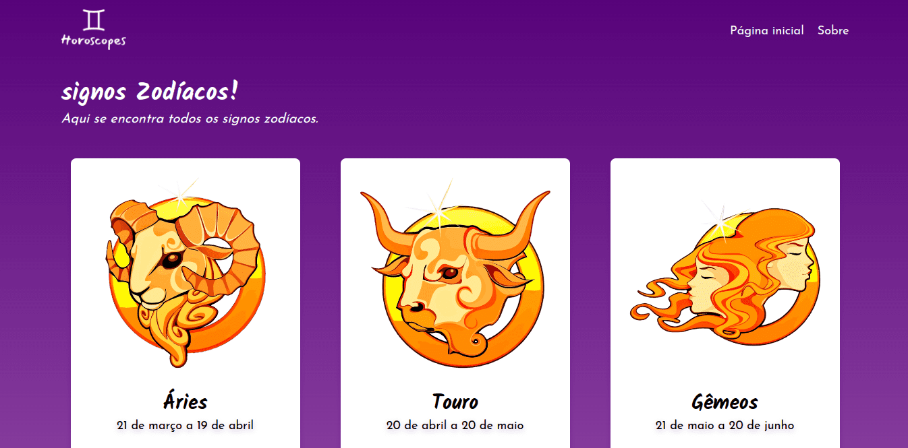
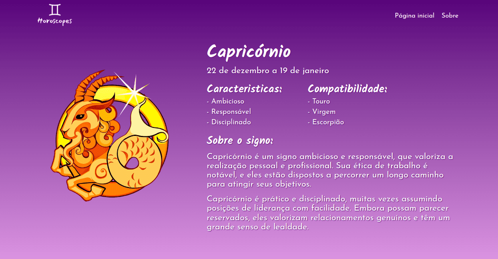

# Signs

    A aplicação de signos e horóscopos foi desenvolvida para praticar os conceitos do
    vueJs. Ela foi inspirada na ideia da
    <a href="https://www.twitch.tv/gaaaabiiiiiiiiii/" target="_blank">gaaaabiiiiiiiiii</a>
    durante uma conversa na live do streamer
    <a href="https://www.twitch.tv/antonydev" target="_blank">AntonyDev</a>.

## Signs API

    O back-end da aplicação foi desenvolvido com o nodeJs utilizando o framework
    <a href="https://fastify.dev/" target="_blank">Fastify</a>. É uma API REST, que utiliza o
    banco de dados MongoDB, com o ORM
    <a href="https://plexinc.github.io/papr/#/" target="_blank">Papr</a>.

    No Github está disponivél a documentação completa da
    <a href="https://github.com/iarlen-reis/signsAPI" target="_blank">API</a>, ela possui
    endpoints para criação, listagem, atualização e remoção de signos. Foi utilizando também a
    plataforma <a href="https://cloudinary.com/" target="_blank">Cloudinary</a> para armazenar
    as imagens dos signos.

## Funcionalidades
- [x] Listagem de signos na página.
- [x] Exibição de detalhes de um signo.
- [x] Cache das requisições de signos e detalhes do signo.
- [ ] Testes unitários.

## Ferramentas

Ferramentas utilizadas no desenvolvimento.

[@VueJs](https://vuejs.org/)

[@TypeScript](https://www.typescriptlang.org/)

[@Sass](https://sass-lang.com/)

[@TanStack](https://tanstack.com/)